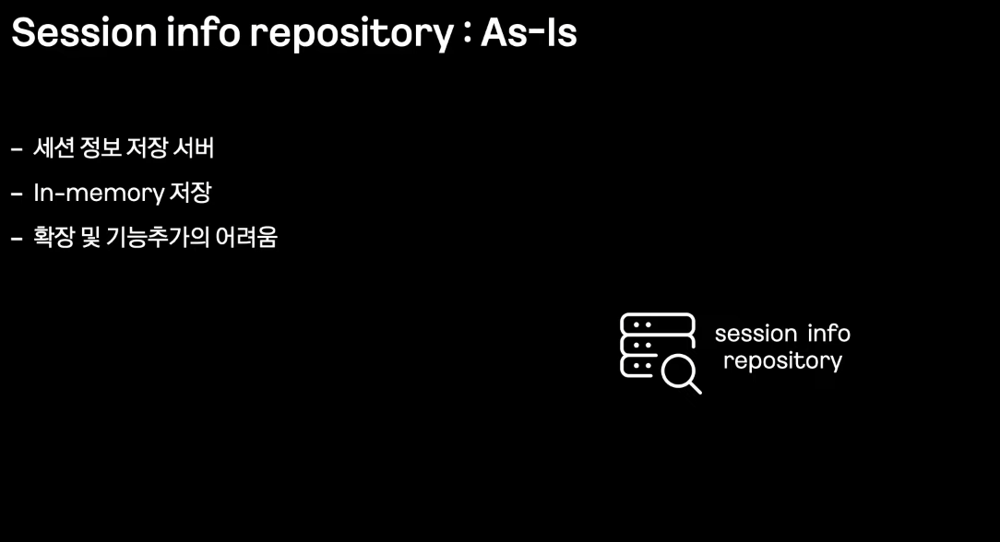
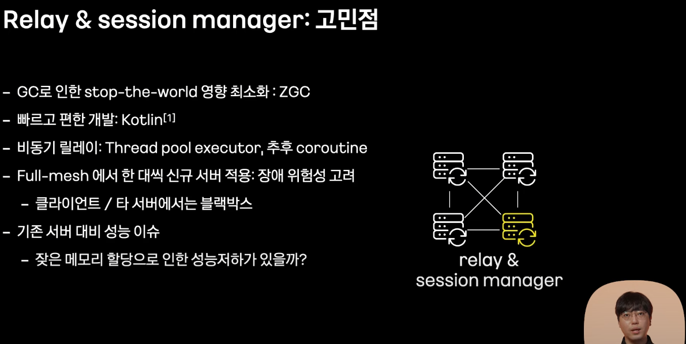
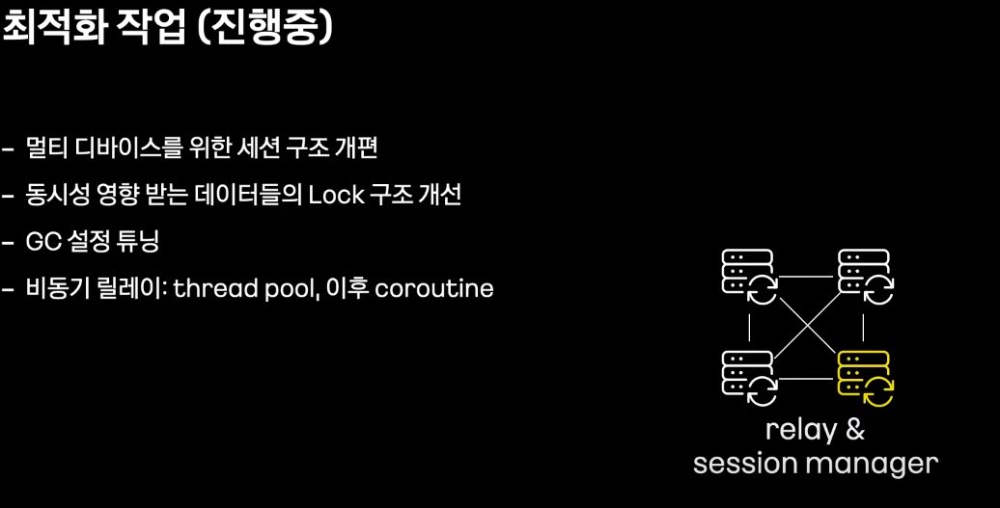

# 카카오톡 메시징 시스템 재건축 이야기: C++ 서버를 Java및 Kotlin으로
- 클라우드 저장소 서비스는 높은 인기를 누리게 된 대표적 클라우드 서비스 

## 서론

- 일 평균 초당 50만 정도 요청, 평균 4천만개의 세션, 6백만 최고 초당 트래픽

(?) 자체 프로토콜을 통한 패킷 경량화 및 통신 최적화는 어떻게 할까?

- c++ 백엔드 서버
  - epoll 기반 비동기 입출력
  - 쓰레드 별로 미리 할당한 메모리 버퍼 사용
  - 대당 500K 이상 세션 관리

(?) 성능 최적화 관점과 좋은 코드는 사실 트레이드 오프 관계일까? 

## 본론
### 1차 재 건축

#### Private API Server

#### Session Info Repository

### 2차 재 건축

(?) 다른 분들은 GC에 대한 튜닝 경험이 있으면 듣고 싶다(ZGC 찾아봤는데 어렵....)

- CPU 차이가 왜이리 많이 날까... JVM 떄문??

## 결론

